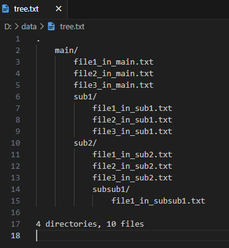

# single-line-commands
This repository basically lists commands that can be executed with only one line of input.
## List of commands
### For Linux/Unix systems
***
#### Function: Display file/directory hierarchies expressed in tab characters. Directory names end with '/'.
```
tree -F|sed -e "s/[ │├──└]/ /g" |sed -e "s/    /\t/g; s/\*//g">../tree.txt
```
* Example: Output text content


:::note info
* This can be used on Linux/Unix systems.
* The tree command must be installed beforehand.
:::
***
